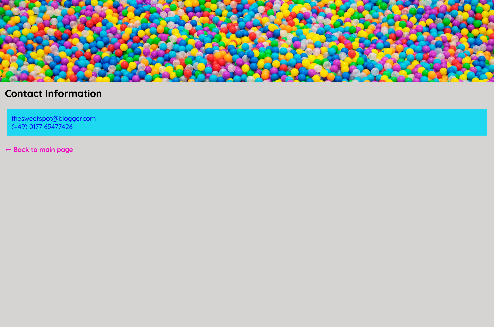

# The Sweet Spot v4
Please note that we didn't do the Sweet Spot v3 last time, and this exercise covers the key features of v3 & v4. Please import the V2 files in this repo and continue to work here.
Let's polish up **The Sweet Spot** by adding some details to our **UI** to make it a bit more modern and professional. Have a look at the new and improved **v4** below -

#### Main Page

#### Contact Page

#### Tab

### Instructions

> - Make sure to do apply a soft **CSS Reset** to the page
> - Apply `margin` and `padding`
> - Change the banner images on the main and contact pages to **background images**
> - Using the `:root` **pseudo-class**, set your `font-size` to a value of `62.5%`. You will need need to refactor your values that use `px` to `rem` (or `em`) units.
> - Add `lollipop.ico` in the `images` directory to your document so that it is displayed in the browser tab - don't forget the contact page as well!
> - Import the **Quicksand** and **Monoton** fonts from **Google Fonts** and use as shown in the reference images
> - Add a `text-shadow` to the `h1` element in the `header` to achieve the outline effect in the reference image
> - From **Fontawesome**, add the **candy cane** and **cookie** icons to the page
> - Use the `::after` **pseudo-element** to add the **cookie** icon in your stylesheet
> - Add the **back arrow** to the '**Back to main page**' text on the contact page
> - Take a few moments to look at the [live version](https://digitalcareerinstitute.github.io/UIB-UI-UX-the-sweet-spot-v4/) and implement any other small changes that are present
> > - If you need more dummy text, here is the link - http://www.cupcakeipsum.com/
> - As always, **pixel perfect** :)
